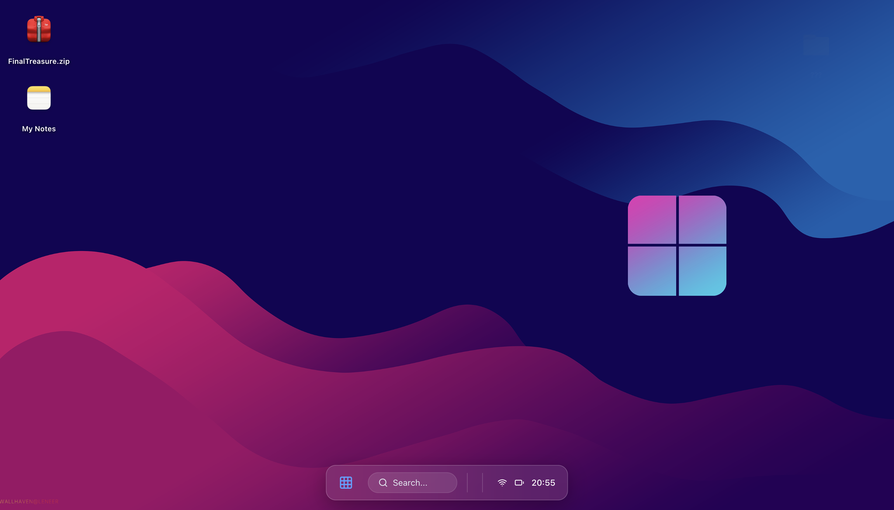
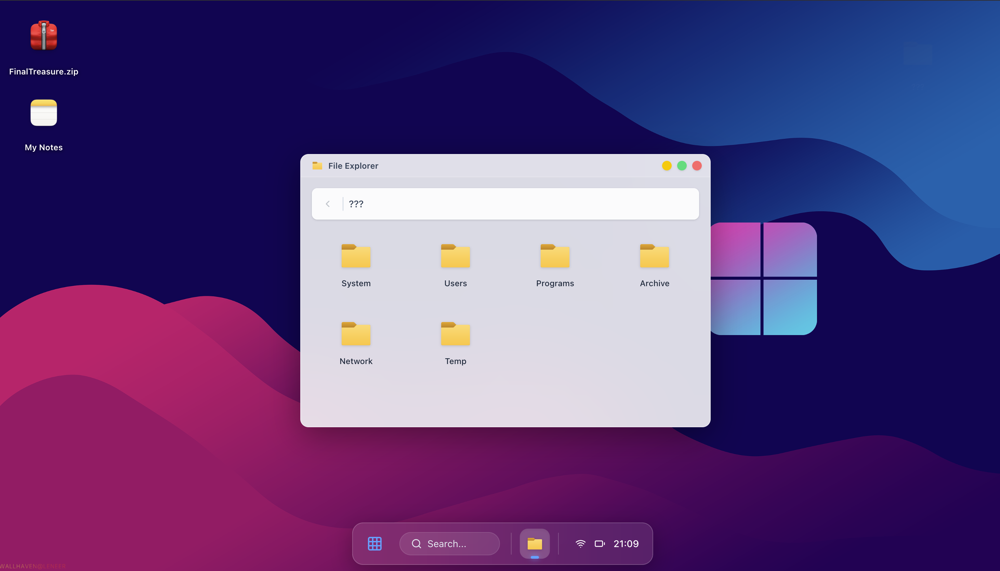
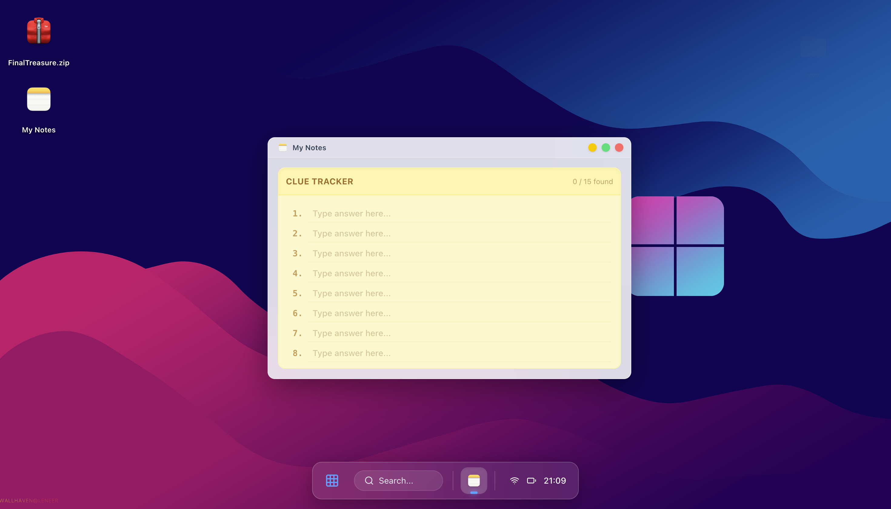
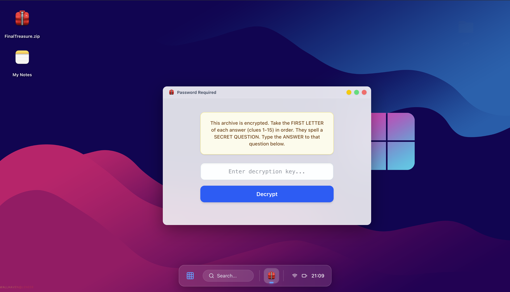

# 🖥️ MindMaze '26 — System-Level OS Simulation Platform

### Official Technical Event Platform for Gyan Mitra '26

MindMaze '26 is a high-performance, browser-based operating system simulation engineered for a live technical symposium at Mepco Schlenk Engineering College.

Designed and deployed by me as Lead Developer and Event Organizer, this platform transforms core Computer Science concepts into a gamified, system-level challenge inside a simulated desktop environment.

---

## 🚀 Project Vision

This project was built to:

- Simulate a modern desktop OS inside the browser
- Test system-level CS fundamentals through interactive puzzles
- Handle real-time participant usage during a live symposium
- Demonstrate frontend architectural thinking beyond static UI design

This is not just a React app —  
It is a structured, interactive system environment built with production thinking.

---

## 🏗️ Architecture & Engineering Design

### Frontend Stack

- React 18
- TypeScript (Strict mode enabled)
- Vite (Fast HMR + optimized bundling)
- Tailwind CSS v4 (GPU-accelerated blur & responsive utilities)

---

### 🪟 Custom Window Management Engine

Engineered a centralized window manager to handle:

- Z-index stacking control
- Focus switching logic
- Minimize / Restore state
- Independent window isolation
- Dynamic mount/unmount lifecycle control

---

### 💾 Persistent State Architecture

Implemented lifted-state management to:

- Preserve user progress across windows
- Maintain riddle answers inside “My Notes”
- Prevent accidental state loss during UI transitions
- Ensure predictable rendering behavior

---

### 📁 Virtual File System Simulation

Built a nested directory system that:

- Mimics OS-level folder navigation
- Contains hidden system directories
- Unlocks content conditionally
- Controls puzzle progression through logical gating

---

### ⚡ Performance Engineering

- Controlled re-renders with granular state segmentation
- Optimized component mount cycles
- Avoided unnecessary reconciliation
- Ensured smooth interaction under event load

---

## 🎮 The Challenge Logic

Participants must:

1. Navigate a hidden system directory (`???`)
2. Discover 15 technical riddles
3. Solve concepts from:
   - Operating Systems
   - DBMS
   - Logic Gates
   - Computer Architecture
4. Track answers in a simulated Notes application
5. Generate a secret phrase
6. Unlock `FinalTreasure.zip` to win

This required structured information flow, state-dependent unlocking, and controlled progression logic.

---

## 📊 Real-World Deployment

- Built for live symposium usage
- Designed for simultaneous participants
- Used as the official event competition platform
- Tested under real-time event conditions

This was not a demo build.  
It was production-used for an academic technical event.

---

## 🖼️ Screenshots

### 🖥️ Desktop Interface



---

### 📂 File Explorer & Hidden Directory



---

### 📝 My Notes Application



---

### 🔐 Final Treasure Unlock




## 🛠️ Installation & Local Setup

```bash
# Clone repository
git clone https://github.com/abishekkvh/College-Events.git

# Navigate to project
cd Gyan-Mitra/MindMaze26

# Install dependencies
npm install

# Start development server
npm run dev
